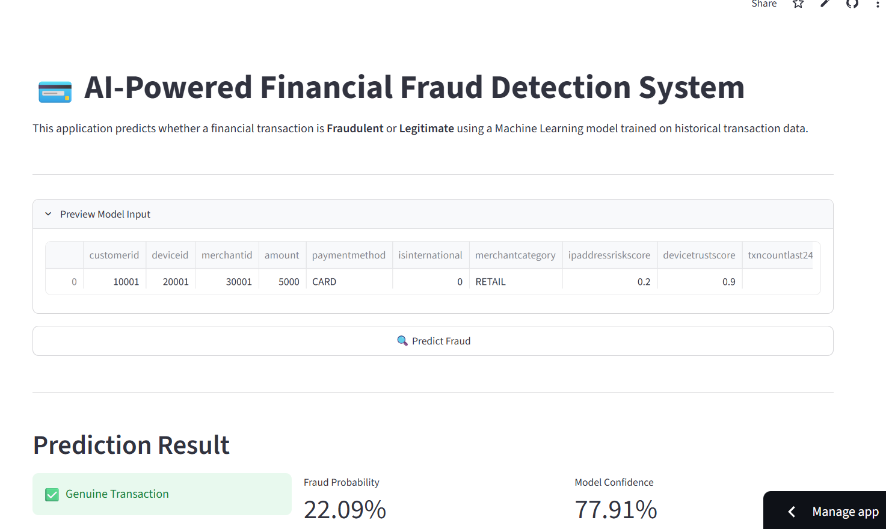

# 💳 AI-Powered Financial Fraud Detection System

## 🚀 Live Demo

👉 **Try the deployed application:**
https://bit-byte-builder-fraud-detection-in-online-transacti-app-2ccd8d.streamlit.app/

---

### ✨ Key Features

- 🔍 Real-time Fraud Prediction
- 🤖 Machine Learning Powered (Random Forest)
- 📊 Fraud Probability Score
- ⚠️ Risk Level Assessment
- ✅ Business Action Recommendation
- 📈 Interactive Streamlit Dashboard
- 🧠 Advanced Feature Engineering

- ## 🖼️ Application Preview

## 🖼️ Application Preview
## 🖼️ Application Preview

### 🏠 Home Screen



### 📊 Prediction Dashboard


### ✅ Recommended Action


# Fraud Detection in Online Transactions

## Project Overview
This project builds an end-to-end machine learning pipeline to detect fraudulent online transactions. The workflow includes data validation, exploratory data analysis, feature engineering, preprocessing, model training, threshold tuning, and business recommendations for fraud mitigation.

## Business Problem
PaySphere Digital Payments Pvt. Ltd. processes millions of transactions across UPI, cards, net banking, and wallets. The fraud team faces rising fraudulent activity, class imbalance, false negatives, and false positives, making it important to build a model that can detect fraud while keeping customer friction low.

## Objectives
- Detect fraudulent transactions accurately.
- Reduce false positives and false negatives.
- Engineer meaningful behavioral and transaction-based features.
- Build and evaluate machine learning classification models.
- Tune the fraud decision threshold for business use.
- Provide actionable fraud risk insights.

## Tech Stack
- Python
- Pandas
- NumPy
- Matplotlib
- Seaborn
- Scikit-learn
- XGBoost
- Imbalanced-learn
- Joblib
- Streamlit

## Workflow
1. Data loading and schema inspection.
2. Data validation and quality checks.
3. Exploratory data analysis.
4. Feature engineering.
5. Data preprocessing.
6. Model training.
7. Model evaluation.
8. Threshold tuning.
9. Business recommendations.

## Dataset
The dataset contains 50,000 online transactions with features such as amount, payment method, international flag, merchant category, device trust score, IP risk score, OTP success rate, fraud history, disputes, and time-based patterns. The final target variable is `isfraud`.

## Data Validation
The notebook checks for missing values, duplicate transaction IDs, negative transaction amounts, invalid labels, timestamp issues, and out-of-range values. The dataset used in the project passed these validation checks.

## Feature Engineering
Several fraud-relevant features were created from the raw dataset, including:
- Amount deviation ratio.
- Amount deviation difference.
- IP-device risk interaction.
- Combined change flag.
- Weekend-night flag.
- Weak authentication flag.
- High-risk payment flag.
- Customer transaction sequence.
- Customer-device pair count.
- Customer-merchant pair count.

These engineered features help capture behavioral anomalies and risk patterns more effectively than raw fields alone.

## Model Training
The notebook compares multiple models, including Logistic Regression and Random Forest. The final evaluation focuses on Random Forest for deeper assessment, while Logistic Regression is also reported as a benchmark model.

## Model Performance

### Initial Model Evaluation (Default Threshold = 0.5)
- ROC-AUC: 0.688956
- PR-AUC: 0.198123
- Precision (class 1): 0.22
- Recall (class 1): 0.39
- F1 Score (class 1): 0.28
- Accuracy: 0.80

### After Threshold Tuning
- Best Threshold (based on F1-score): 0.55
- Precision (class 1): 0.23
- Recall (class 1): 0.37
- F1 Score (class 1): 0.28
- Accuracy: 0.81

The tuned threshold slightly improves precision and accuracy, while recall decreases a little, showing the normal trade-off in fraud detection between catching more fraud and reducing false alerts.

## Saved Artifacts
The final deployed model is saved as `models/fraudpipeline.pkl`, and the model metadata is saved as `models/modelmetadata.pkl`.

## Project Structure
```text
Fraud-Detection-in-Online-Transactions/
├── app.py
├── README.md
├── requirements.txt
├── models/
│   ├── fraudpipeline.pkl
│   └── modelmetadata.pkl
└── notebooks/
    └── Fraud_Detection_Capstone_Project-1.ipynb
```

## Requirements
- numpy
- pandas
- matplotlib
- seaborn
- scikit-learn
- xgboost
- imbalanced-learn
- joblib
- streamlit

## Business Insights
- Device changes and location changes are strong fraud indicators.
- International transactions show a higher fraud rate than domestic transactions.
- Fraud risk increases when risky behavior combines with weak authentication.
- Threshold tuning is useful when balancing fraud capture against false positives.

## Conclusion
This project demonstrates a complete fraud detection pipeline for online transactions, from validation and feature engineering to model evaluation and deployment. The final model and metadata are saved in the `models/` folder for Streamlit use and future scoring..

## Author
**Sachin Kumar**
