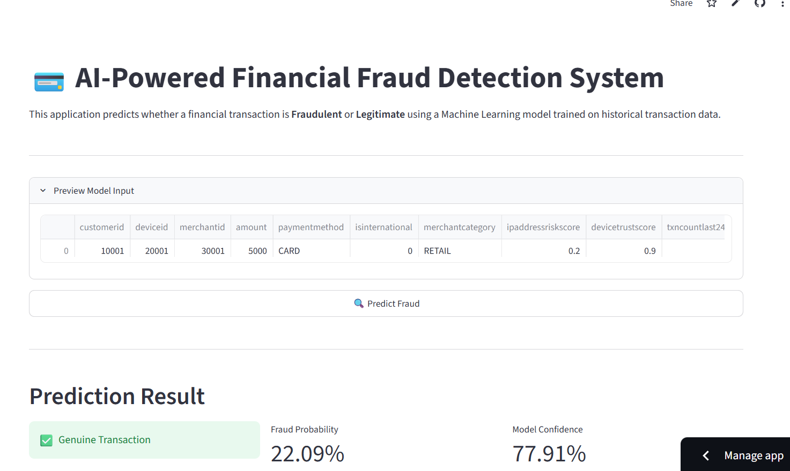
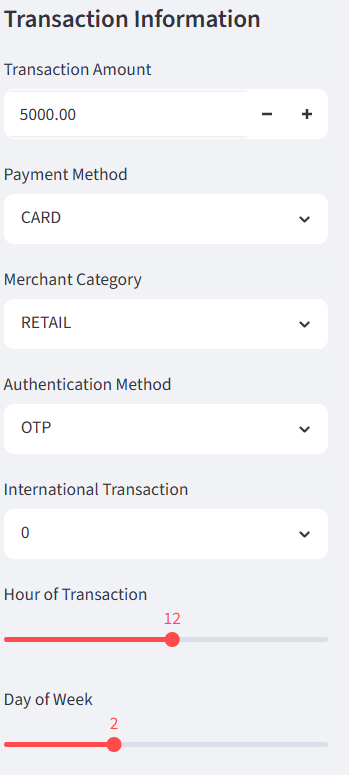
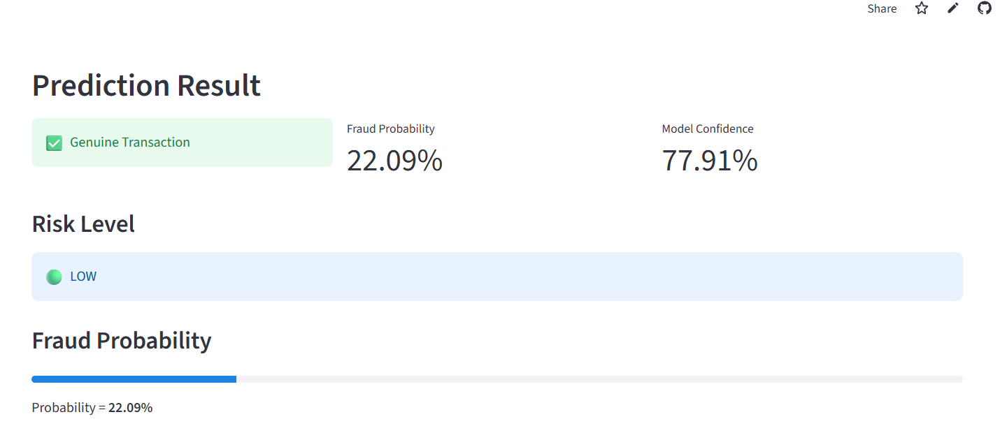

# 💳 AI-Powered Financial Fraud Detection System
An end-to-end machine learning system for detecting potentially fraudulent online transactions and translating model predictions into actionable risk decisions.


## 🚀 Live Demo

**Try the deployed application:**
👉 https://bit-byte-builder-fraud-detection-in-online-transacti-app-2ccd8d.streamlit.app/

---


## 🖼️ Application Preview

### 🏠 Home Screen



### 📝 Transaction Input Form



### 📊 Prediction Dashboard



### ✅ Recommended Action & Engineered Features


## 📌 Project Overview

Online payment systems need to identify fraudulent transactions while minimising false alerts that can create unnecessary customer friction.

This project builds an end-to-end machine learning pipeline to detect potentially fraudulent online transactions and translate model predictions into practical fraud-risk decisions.

The workflow covers:

**Data Validation → Exploratory Data Analysis (EDA) → Feature Engineering → Preprocessing → Model Training → Model Evaluation → Threshold Tuning → Business Recommendations → Deployment**

The project combines transaction and behavioural features with machine learning to identify potentially fraudulent transactions while maintaining a practical balance between fraud detection and false alerts.

---

## 💼 Business Scenario

**PaySphere Digital Payments Pvt. Ltd.** is a fictional digital-payments company that processes millions of transactions across UPI, cards, net banking, and digital wallets.

As transaction volumes increase, the fraud detection team needs to identify suspicious transactions while minimising unnecessary disruption to legitimate customers.

The key challenges include:

- Increasing fraudulent activity
- Class imbalance
- False negatives
- False positives
- Customer friction caused by unnecessary transaction blocks

Therefore, the objective is to develop a machine learning solution that can identify potentially fraudulent transactions while maintaining a practical balance between fraud detection and false alerts.

---


## 🎯 Objectives

- Detect fraudulent transactions accurately.
- Reduce false positives and false negatives.
- Engineer meaningful behavioral and transaction-based features.
- Build and evaluate machine learning classification models.
- Handle class imbalance appropriately.
- Tune the fraud decision threshold for business use.
- Generate fraud probability and risk-level assessments.
- Provide actionable fraud-risk insights and recommendations.
- Deploy the trained model through an interactive Streamlit application.

---

## 📊 Dataset

The dataset contains 50,000 online transactions with features such as amount, payment method, international flag, merchant category, device trust score, IP risk score, OTP success rate, fraud history, disputes, and time-based patterns. The final target variable is `isfraud`.


## 🔍 Data Validation

The notebook checks for missing values, duplicate transaction IDs, negative transaction amounts, invalid labels, timestamp issues, and out-of-range values. The dataset used in the project passed these validation checks.

## 📈 Exploratory Data Analysis

Exploratory Data Analysis was performed to understand fraud prevalence and identify relationships between fraudulent transactions and important transaction, customer, device, payment, and behavioural characteristics.

The findings from EDA were used to guide feature engineering and model development.

## 🧠 Feature Engineering

Several fraud-relevant features were created from the raw dataset, including:
- Amount deviation ratio.
- Amount deviation difference.
- IP-device risk interaction.
- Combined change flag.
- Weekend-night flag.
- Weak authentication flag.
- High-risk payment flag.
- Customer transaction sequence.
- Customer-device pair count.
- Customer-merchant pair count.

These engineered features help capture behavioral anomalies and risk patterns more effectively than raw fields alone.

## 🤖 Model Training

The notebook compares multiple classification models, including:

### Logistic Regression

Used as a benchmark model to establish a baseline for comparison.

### Random Forest

Used as the primary model for deeper evaluation and deployment.

The modelling workflow includes:

1. Data preprocessing
2. Feature engineering
3. Class-imbalance handling
4. Model training
5. Probability prediction
6. Model evaluation
7. Decision-threshold tuning

## 📏 Model Evaluation

Because fraud detection is an imbalanced classification problem, accuracy alone is not sufficient for evaluating model performance.

The project evaluates the model using:

- ROC-AUC
- PR-AUC
- Precision
- Recall
- F1 Score
- Accuracy

## 📊 Model Performance

### Initial Model Evaluation (Default Threshold = 0.5)
| Metric              |    Score |
| ------------------- | -------: |
| ROC-AUC             | 0.688956 |
| PR-AUC              | 0.198123 |
| Precision (Class 1) |     0.22 |
| Recall (Class 1)    |     0.39 |
| F1 Score (Class 1)  |     0.28 |
| Accuracy            |     0.80 |


## 🎚️ Threshold Tuning

The fraud decision threshold was tuned using F1 Score as the optimisation criterion.
| Metric              | Score |
| ------------------- | ----: |
| Precision (Class 1) |  0.23 |
| Recall (Class 1)    |  0.37 |
| F1 Score (Class 1)  |  0.28 |
| Accuracy            |  0.81 |


The tuned threshold slightly improves precision and accuracy while reducing recall.

This demonstrates the precision-recall trade-off involved in fraud detection.

In general, lowering the classification threshold can increase the number of transactions flagged as potentially fraudulent, which may improve recall but can also increase false positives. Raising the threshold can reduce false alerts but may allow more fraudulent transactions to pass undetected.

In this project, the threshold of **0.55 was selected based on F1-score optimisation.** In a production fraud-detection system, the appropriate threshold should also consider the relative business costs of false positives and false negatives.

> **Note:** The reported metrics are based on the evaluation setup documented in the project notebook and should be interpreted in the context of the dataset and validation methodology. They should not be considered production-level fraud-detection performance.


## 🖥️ Streamlit Application

The trained model is integrated into an interactive Streamlit application.

### ✨ Key Features

- 🔍 Real-time Fraud Prediction
- 🤖 Machine Learning Powered (Random Forest)
- 📊 Fraud Probability Score
- ⚠️ Risk Level Assessment
- ✅ Business Action Recommendation
- 📈 Interactive Streamlit Dashboard
- 🧠 Advanced Feature Engineering

The application allows users to provide transaction information and receive a model-generated fraud-risk assessment.

## 💡 Business Insights
The analysis identified several patterns associated with increased fraud risk:

- Device changes can be important fraud indicators.
- Location changes can indicate potentially suspicious behaviour.
- International transactions show a higher fraud rate than domestic transactions in the analysed dataset.
- Fraud risk increases when risky behavior combines with weak authentication.
- Behavioural and interaction-based features can provide additional predictive information beyond basic transaction attributes.
- Threshold tuning is useful when balancing fraud capture against false positives.

> **Important:** These observations are specific to the analysed dataset and should be validated against production data before being used as operational fraud rules.

## 💾 Saved Artifacts

The final deployed model and supporting metadata are stored in the models/ directory.

```text
models/
├── fraudpipeline.pkl
└── modelmetadata.pkl
```
### `fraudpipeline.pkl`

Contains the trained fraud-detection pipeline/model used by the Streamlit application.

### `modelmetadata.pkl`

Contains supporting model metadata required by the application.

## 🏗️ Project Structure

```text
Fraud-Detection-in-Online-Transactions/
│
├── app.py
├── Fraud_Detection_Capstone_Project.ipynb
├── README.md
├── requirements.txt
├── LICENSE
│
├── models/
│   ├── fraudpipeline.pkl
│   └── modelmetadata.pkl
│
└── screenshots/
    ├── 01_Home_Page.png
    ├── 03_Prediction_Result_Low_Risk.png
    └── 04_Approved_Transaction_Recommendation_Engineered_Features.png
```

## 🛠️ Tech Stack

### Programming Language
- Python

### Data Analysis
- Pandas
- NumPy

### Data Visualization
- Matplotlib
- Seaborn

### Machine Learning
- Scikit-learn
- XGBoost
- Imbalanced-learn

### Model Management
- Joblib

### Application & Deployment
- Streamlit

## 📦 Requirements

The project requires the following Python packages:
- numpy
- pandas
- matplotlib
- seaborn
- scikit-learn
- xgboost
- imbalanced-learn
- joblib
- streamlit
  
All dependencies are also listed in `requirements.txt`.

## ⚙️ Installation & Setup

### 1. Clone the Repository

```bash
git clone https://github.com/Bit-Byte-Builder/Fraud-Detection-in-Online-Transactions.git
cd Fraud-Detection-in-Online-Transactions
```

### 2. Install Dependencies

```bash
pip install -r requirements.txt
```

### 3. Run the Streamlit Application

```bash
streamlit run app.py
```

## 🔮 Future Improvements

Potential improvements to the project include:

- Hyperparameter optimisation for Random Forest and XGBoost.
- Cross-validation for more robust performance estimation.
- Temporal validation to better simulate real-world fraud detection.
- Probability calibration.
- Cost-sensitive threshold optimisation.
- SHAP-based model explainability.
- Batch transaction scoring.
- Real-time transaction monitoring.
- Data-drift monitoring.
- Model-performance monitoring.
- Integration with a production database or transaction API.
- Automated retraining pipelines.

## ⚠️ Limitations

This project is designed as a machine learning and portfolio project.

Model performance depends on:

- Dataset quality
- Feature availability
- Class distribution
- Validation methodology
- Model selection
- Decision-threshold selection

A production fraud-detection system would require additional considerations such as:

- Real-time transaction streams
- Data drift
- Concept drift
- Model monitoring
- Explainability
- Fraud investigation workflows
- Cost-sensitive decision-making
- Security controls
- Regulatory and compliance requirements

## 📚 Learning Outcomes

This project provided practical experience with:

- Data validation
- Exploratory Data Analysis
- Feature engineering
- Classification modelling
- Imbalanced datasets
- Model evaluation
- Precision-recall trade-offs
- Threshold optimisation
- Model persistence
- Streamlit deployment
- Translating machine learning predictions into business recommendations

## 📌 Conclusion

This project demonstrates an end-to-end machine learning approach to online transaction fraud detection, covering data validation, exploratory data analysis, feature engineering, model training, evaluation, threshold tuning, and Streamlit deployment.

The project also highlights the importance of balancing fraud detection with false-positive costs when designing a practical fraud-risk system.

The trained model and supporting metadata are saved in the `models/` directory for use by the Streamlit application.

## 👨‍💻 Author
**Sachin Kumar**
